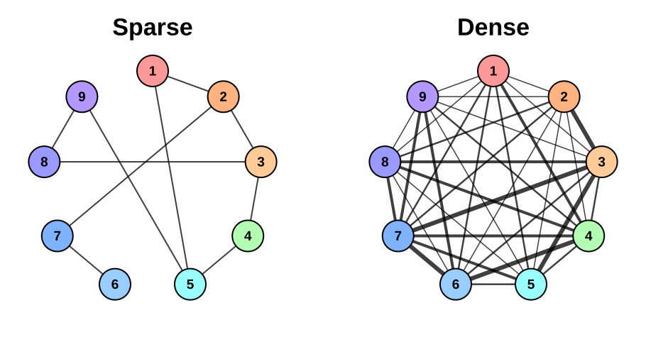
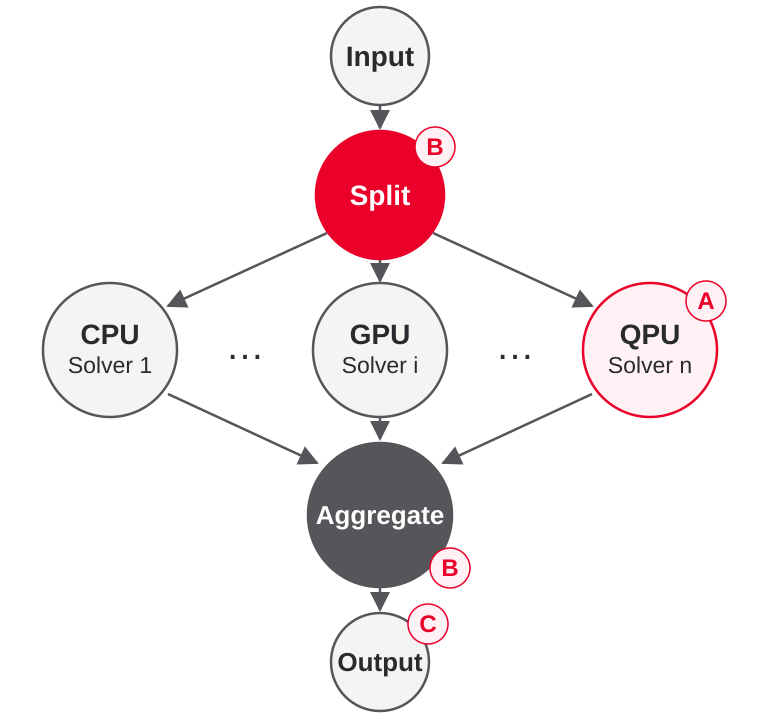
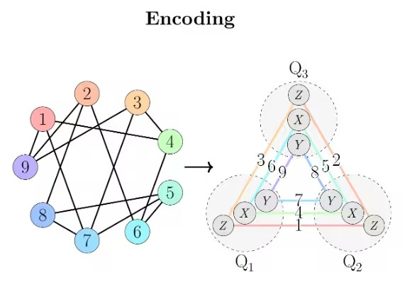
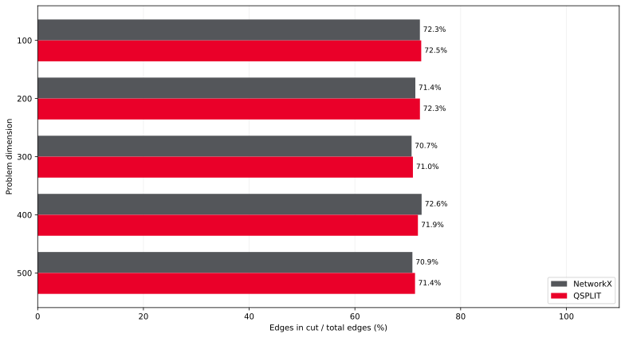

# QSplit A Workflow-Oriented Hybrid Quantum-Classical Optimization Framework

Mario Bifulco, Francesco Medina, Doriana Medić, Luca Roversi, Marco Aldinucci

<!-- 
University of Turin - Department of Computer Science
 -->

**QSplit in a nutshell**
QSplit enables quantum optimization beyond current QPU size through structure-aware decomposition, compact problem representations, and modular HPC-QPU integration.

## 01 Motivation

### Quantum as an accelerator

Quantum computing can act as an accelerator inside HPC workflows

### Problems outgrow QPUs

Real industrail optimization problems are much larger than current noisy QPUs

### Workflow portability

Significant differences across quantum vendors require tailored approaches to orchestrate heterogeneous resources

## 02 Objectives

- **Scale the problem**: Study decomposition and aggregation techniques for large QUBO instances
- **HPC-Quantum integration**: Integrate quantum solvers efficiently into HPC optimization workflows, reducing classical-quantum data movement

## 03 Problem & data

**Quadratic Unconstrained Binary Optimization (QUBO)**

$$\min_{x\in\{0,1\}^{n}} x^{\mathsf T}Qx \footnotesize\qquad Q\in\mathbb{R}^{n\times n}, n\in \{0, 1\}$$

QSplit is **problem-agnostic**, supporting any problem formulated as a QUBO, while its performance depends on the **instance structure**, including coefficient sparsity, distribution, and magnitude

## 04 Methodology

### A modular split-solve-aggregate pipeline

QSplit allows a modular workflow tailored for optimization problems and orchestrated via **Streamflow** workflow management system.

### A Quantum solvers

- **Fewer variational cycles**: Study QAOA parameterizations that reduce the number of classical-quantum optimization loops
- **HPC training + QC optimization**: Move QAOA parameter training to HPC resources and use quantum resources for optimization
- **Compact quantum encoding**: Pauli Correlation Encoding (PCE) represents logical QUBO variables through correlations over fewer qubits

### B Structure-aware pipeline

Structure-aware splitting methods aim to preserve as much information as possible in each subproblem, simplifying subsequent aggregation

### C One-shot approach

QSplit currently uses single-pass optimization, aiming to find the best possible solution with minimal resource use

## 05 Results

50xHandled problems

- 99%Variational loops

QSplit allows to optimize Max-Cut problems bigger than the QPU with a lightweight variational training with almost no performance drop

 QSplit aims to reduce the size of each quantum task and the cost of its integration into the classical workflow

## 06 Future work

### QOLC

Quadratic objectives with linear constraints: incorporate constraints into mixers

### QUIO

Extend to Quadratic Unconstrained Integer Optimization to address a broader class of real-world problems

### Refinement process

Provide an optional refinement process in order to balance resource consumption and quality solution

<h3>

GitHub
</h3>

<h3>

Paper
</h3>

<h3>Contact</h3>

<strong>TODO</strong>

name.surname@unito.it

